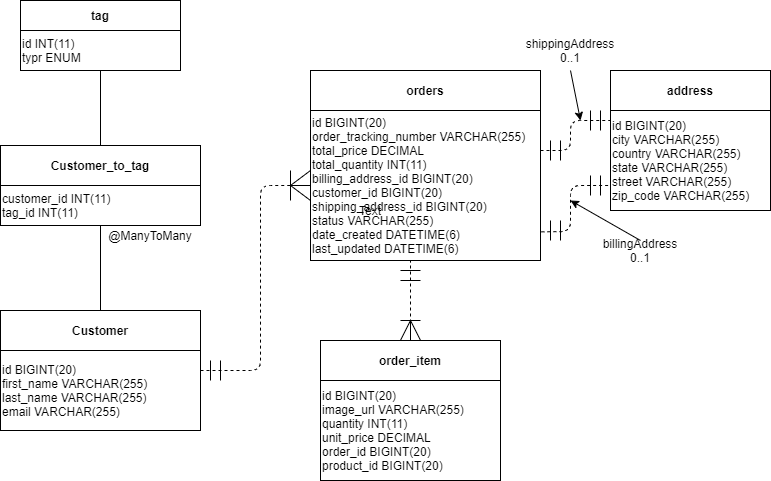
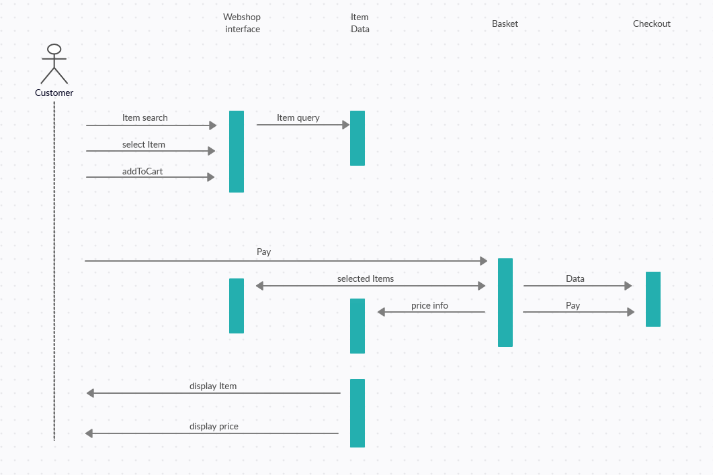
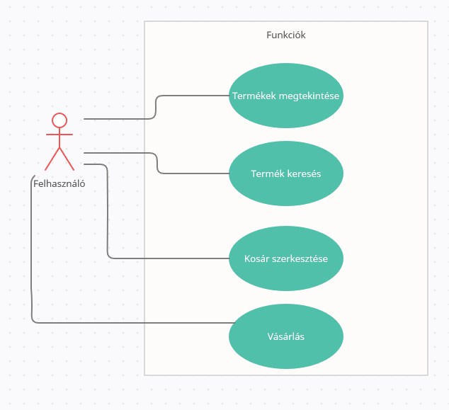
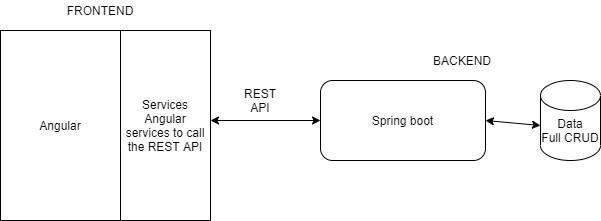
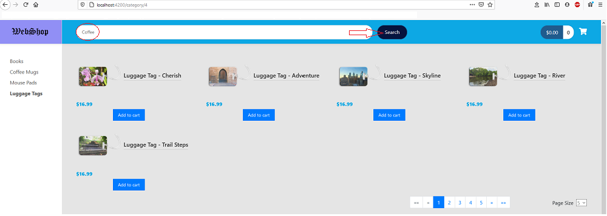
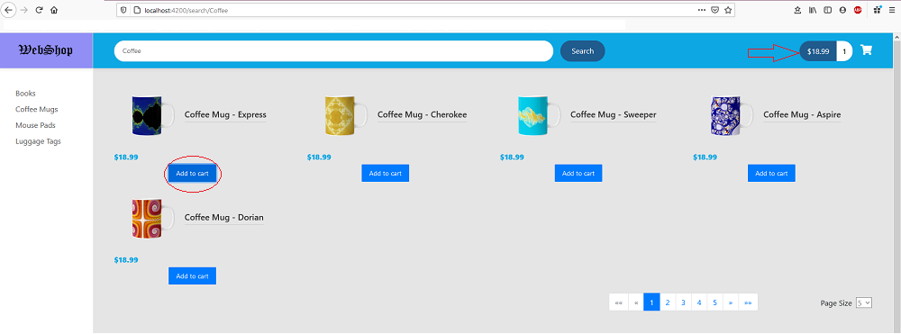
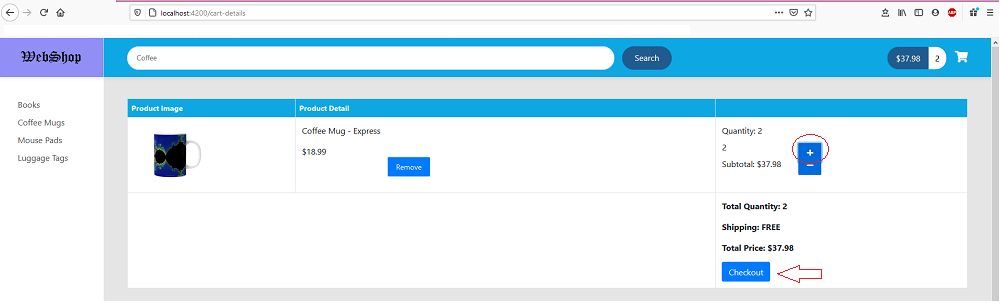
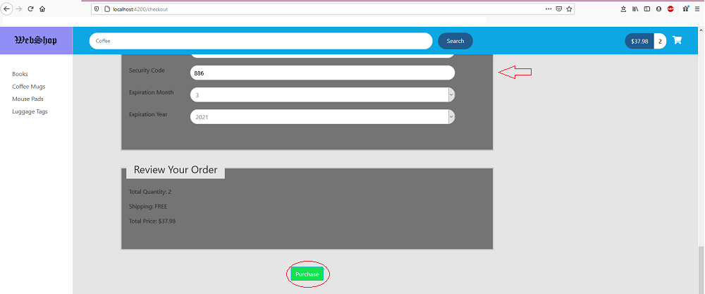
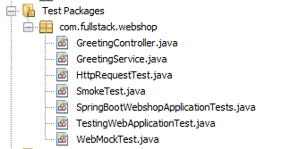

# Webshop
## Tárgy: Full-stack webprogramozás 
## Készítői: Nádai Zsombor Csaba, Magyar Dorina

Leírás: Egyszerű kis webshop ami különleges és érdekes termékeket kínál az oldal látogatóinak.

## Alkalmazás funkcionális követelményei:

* Felhasználó:
  - Amit csinálhat:
    - megtekinthetik a termékeket
    - módosíthatják a kosarukat
    - vásárolhatnak
  - Amit nem csinálhat:
    - módosítani a termék
* Tulajdanos/Admin:
  - Amit csinálhat:
    - módosíthatja az alkalmazást
    - módosíthatja a termékek leírását, nevét ..stb
    - törölhet terméket
    - új terméket adhat hozzá
  - Amit nem csinálhat:
    - adatok nem megfelelő használata
        
## Az alkalmazás nem funkcionális követelményei:

* Az alkalmazásnak átláthatónak és könnyen kezelhetőnek kell lennie.
* Az alkalmazásnak az adatokat biztonságosan kell kezelnie és tárolnia, kiváltképpen az érzékeny hitelesítő adatokat, amelyek az autentikációhoz szükségesek.
* Az alkalmazásnak gyors válaszidejűnek kell lennie.
* Az alkalmazásnak szinte folyamatosan, minimális rendszerleállásokkal kell működnie a problémák elkerülése miatt.
* A rendszer adatbázisának jól szervezettnek kell lennie, a dinamikusságot elősegítve.

## Szakterületi fogalomjegyzék:

* Menüsor:
     - Főoldal: megnyitja a főoldalt, ha rajta vagyunk újra tölti
     - Termékek: az összes terméket tartalmazó oldal
     - Keresés: egy bizonyos termék keresése
     - Kosár: a felhaszáló kosarát jeleníti meg
     - Bejelentkezés: megjelenik a bejelentkezési felület
     - Regisztráció: megjelenik a regisztráció felület
        - Ha már be van jelentkezve: 
             - felhasználó neve: Profil szerkesztése
             - Kijelentkezés: kijelentkezik a felhasznló profiljából
* Termék:
     - Képpel rendelkezik
     - Kosárba tesz: bele teszi a terméket a felhasznéló kosarába
     - Termék véleményezése: 5 * -os értékelési rendszer (csak bejelentkezett felhasználóknak elérhető funkció)
* Kosár:
     - +/-: növeli/csökkenti a termék számát
     - Vásárlás: vásárlási felület megnyitása
* Vásárlás:
     - fizetési mód kiválasztása (csak utánvétel)
     - Tovább: rendelés leadása

## Szerepkörök:

* Felhasználó: általános felhasználó, aki termékeket tud keresni és megvásárolni.
* Tulajdonos (Admin):  a weboldal funkcióit aktualizálja, moderátori joga van, a termékeket tartja aktuálisan, ha elfogyott vagy már nem elérhető egy termék törli, módosíthatja a termékek nevét, leírását, árát, új terméket adhat hozzá

## Fejlesztői környezet
### Backendhez használt technológiák

* NetBeans 11.3
  - java.version: 1.8.0_242
  - java.vendor: AdoptOpenJDK - Spring-boot REST API
* MySql WorkBench

### Frontendhez használt technológiák
* VisualStudioCode
  - Typescript 4.0.2 - Angular frontend 11.0.1
  - HTML5/CSS3
  - JSON

## Adatbázis terv (UML)

## Fejlesztői környezet beállítása
Leírás link: https://github.com/Mojoj97/fullstackFrontend/blob/master/README.md

## Könyvtárstuktúra:
### Backend gyökérkönyvtár:

* **backend/spring-boot mappa**
  * **.mvn/wrapper mappák**
    * **MavenWrapperDownloader.java**
    * **maven-wrapper.jar**
    * **maven-wrapper.properties**
  * **src mappa**
    * **main/java/com/fulltack/webshop mappák**
      * **config mappa**
        * **MyDataRestConfig.java**
      * **dao mappa**
        * **CountryRepository.java**
        * **ProductCategoryRepository.java**
        * **ProductRepository.java**
        * **StateRepository.java**
      * **entity mappa**
        * **Country.java**
        * **Product.java**
        * **ProductCategory.java**
        * **State.java**
      * **SpringBootWebshopApplication.java**
  * **resources mappa**
    * **application.properties**
  * **test mappa**
    * **java/com/fullstack mappák**
        * **GreetingController.java**
        * **GreetingService.java**
        * **HttpRequestTest.java**
        * **SmokeTest.java**
        * **SpringBootWebshopApplicationTests.java**
        * **TestingWebApplicationTest.java**
        * **WebMockTest.java**
  * **.gitignore**
  * **mvnw**
  * **mvnw.cmd**
  * **pom.xml**
* **Readme.md** *(a verziókövető rendszer (pl. Git) által alkalmazott szöveges fájl, mely arra szolgál, hogy a projekt iránt érdeklődők tájékozódhassanak azokról a fontos információkról, amelyeket a fejlesztők megosztanának velük (például a könyvtárstruktúra részletes leírását, remélem mindenki elolvassa idáig haha))*

### Frontend gyökérkönyvtár:

* **e2e**
  * **src**
    * **app.e2e-spec.ts**
    * **app.po.ts**
  * **protractor.conf.json**
  * **tsconfig.json**
* **src**
  * **app**
    * **common**
      * **product.spec.ts**
      * **product.ts**
    * **components/product-list**
      * **product-list-grid.component.html**
      * **product-list-table.component.html**
      * **product-list.component.css**
      * **product-list.component.html**
      * **product-list.component.spec.ts**
      * **product-list.component.ts**
    * **services**
      * **product.service.spec.ts**
      * **product.service.ts**
    * **app.component.css**
    * **app.component.html**
    * **app.component.spec.ts**
    * **app.component.ts**
    * **app.module.ts**
  * **assets**
    * **images**
      * **products**
        * **books**
        * **coffeemugs**
        * **luggagetags**
        * **mousepads**
        * **placeholder.png**
      * **logo.png**
      * **webshop.png**
    * **.gitkeep**
  * **environments**
    * **environment.prod.ts**
    * **environment.ts**
  * **favicon.ico**
  * **index.html**
  * **main.ts**
  * **polyfills.ts**
  * **style.css**
  * **test.ts**
* **.rowserslistrc**
* **.editorconfig**
* **.gitignore**
* **.travis.yml**
* **README.md**
* **angular.json**
* **karma.conf.js**
* **package-lock.json**
* **package.json**
* **tsconfig.app.json**
* **tsconfig.json**
* **tsconfig.spec.json**
* **tslint.json**

## Végpont tervek

### Végpont bemutatása (szekvenciáldiagram)

## Használati eset diagram

### Felhasználó:

### Tulajdonos/Admin:

## Felület tervek:

## Kliensoldali szolgáltatások:
* **termékek keresés** *(kereső funkció: termékek között névvel keresés)*
* **kosár megnézése** *(kosár ikon: megnyomásával megjelenik a kosár tartalma)*
* **kosár módosítása** *(kosáron belül található több gomb is)*
 * **termék szám növelése, csökkentése** *(plusz,minusz gomb lenyomása)*
 * **termék törlése** *(kuka ikonú gomb lenyomásával kikerül a termék a kosárból)*
* **vásárlás** *(megjelenik a Costumer oldal, ahol az adatok megadásával és gomb lenyomásával véglegesítheti a rendelést)*
* **bejelentkezés, kijelentkezés** *(bejelentkezési felület, megfelelő adatok megadásával folytathatja a vásárlást)*
* **regisztráció** *(regisztráció során az adatok megadása után belehet jelentkezni az oldalra)*

## Kapcsolat a serverrel:

## Egy funkció folyamata:
BÖGREVÉTEL:

A kliens a fő oldalon van -> jobb oldalt rákattint a "Coffee Mugs" menüpontra -> a kereső menüben beírja hogy "Aspire" -> a "Search gombra kattint -> a "Coffee Mug - Aspire" nevű bögre képére kattint -> elolvassa a termék leírását -> Rákattint az "Add To Cart" gombra -> jobb felső sarokban rákattint a kosár ikonra -> Ellenőrzi a kosár tartalmát -> 2-re növeli a bögre számát -> Rákattint a "checkout" gombra -> Kitölti az adatait -> Mégegyszer ellenőrzi a rendelését -> rákattint a "Purchase" gombra -> Előugró ablakban visszajelzi, hogy a rendelés rögzítve van -> kiírja a rendszer a "tracking numbert" -> rögzíti a rendelést az adatbázisban

## Tesztelés:

## Felhasználói dokumentáció:
Ahogy a felület terven és a funkció bemutatásánál látszik, nagyon egyszerű kezelni az oldalt. A felhasználó számára egyértelmü elnevezéseket adtunk a funkcióknak. A felhasználó közel 100 temék közül válogathat kedvére. Ha kiválasztotta az adott terméket, amit megszeretne vásárolni, akkor csak a kosarához kell adni a megfelelő gombbal ha többet szeretne venni egy adott termékből vagy törölni szeretné utólag a kosarában erre van lehetőség. Ha biztos a megvásárlandó termékekbe akkor az adatai megadásával bankártyás fizetéssel véglegesítve leadhatja a rendelését, amit mi feldolgozunk.
